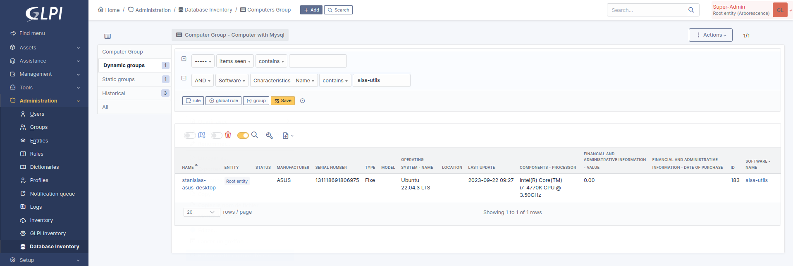
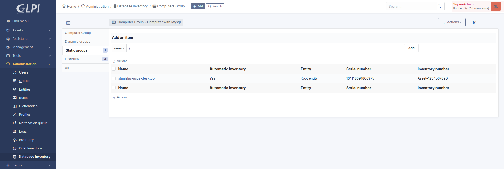
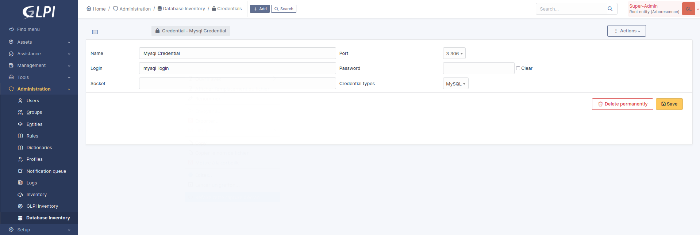
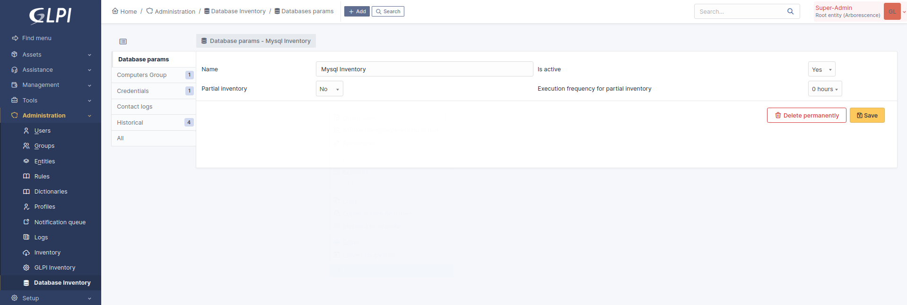
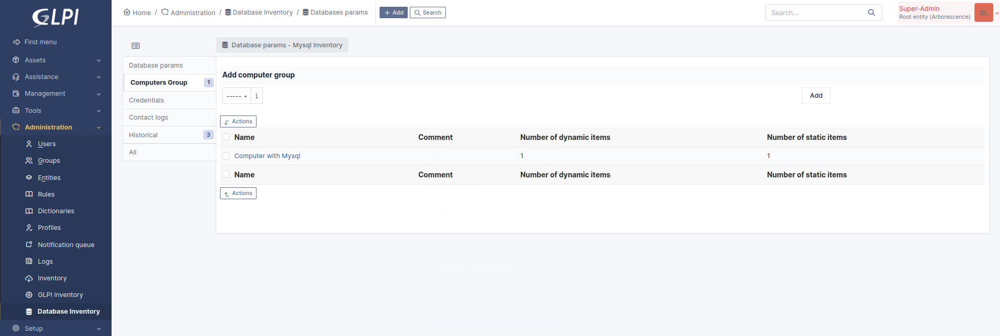
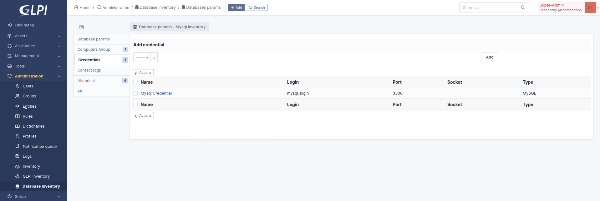

# Plugin GLPI d'inventaire des bases de données

[English README](README.md)

Ce plugin permet de "piloter" les agents d'inventaire Teclib' afin d'executer un inventaire des bases de données présentes sur le poste.


# Sommaire

* [Principe de fonctionnement](#principe-de-fonctionnement)
   * [Agent => GLPI](#agent-glpi)
   * [GLPI => Agent : réponse](#glpi-agent-réponse)
   * [Agent => plugin : récupération des paramètres](#agent-plugin-récupération-des-paramètres)
* [Groupe d'ordinateurs](#groupe-dordinateurs)
   * [Groupe dynamique](#groupe-dynamique)
   * [Groupe statique](#groupe-statique)
* [Identification](#identification)
* [Tâche](#tâche)
* [Inventaire partiel](#inventaire-partiel)


## Principe de fonctionnement

### Agent => GLPI

À son réveil, l’agent contacte le serveur GLPI via le protocole de communication CONTACT.

```
{
  "action": "contact",
  "deviceid": "classic-agent-deviceid",
  "name": "GLPI-Agent",
  "version": "1.0",
  "installed-tasks": [
    "inventory",
    "register",
    "..."
  ],
  "enabled-tasks": [
    "collect",
    "deploy",
    "..."
  ],
  "tag": "awesome-tag"
}
```


### GLPI => Agent : réponse

Le plugin ajoute le paramétrage d’inventaire de base de données dans la tâche d’inventaire d’ordinateur si besoin.

```
{
  "status": "<token>",
  "message": "<optional string>",
  "tasks": [
    {
      "task": "inventory",
      "params": [
        {
          "params_url": "get_databaseparams",
          "category" : "database",
          "use": [ "mysql", "oracle" ],
          "delay": "2h",
          "params_id": 1
        }
      ]
    },
  ]
}
```


### Agent => plugin : récupération des paramètres

Au moment d’éxecuter l’inventaire des bases de données, l’agent recupère les paramétres de configuration de l’inventaire de base de données depuis l’URL fournie par le protocole CONTACT (```get_databaseparams```).

```
{
  "action": "get_params",
  "deviceid": "classic-agent-deviceid",
  "params_id": "id",
  "use": "mongodb",
  "name": "GLPI-Agent",
  "version": "1.0",
}
```

Exemple de retour :

```
{
  "credentials": [
    {
      "id": "id",
      "type": "login_password",
      "use": "mongodb",
      "login": "login",
      "password": "password"
    }
  ]
}
```


## Groupe d'ordinateurs

Permt de définir l'ensemble des postes où devra être effectué l'inventaire des bases de données.


### Groupe dynamique

Il est possible de définire une liste dynamique en fonction d'une recherche.




### Groupe statique

Il est possible de définire une liste statique.



## Identification

Permet de renseigner les identifiants de connexions aux bases de données.




## Tâche

Permet de définir les éléments suivants :
- nom;
- état d'activation;
- inventaire partiel;
- fréquence d'exécution de l'inventaire partiel;
- liste des ordinateurs;
- liste des informations de connexion à utiliser.









## Inventaire partiel

L'inventaire partiel permet d'indiquer à l'agent d'effectuer uniquement l'inventaire de base de données (sans l'inventaire du poste) en fonction de la fréquence définit dans la tâche.
